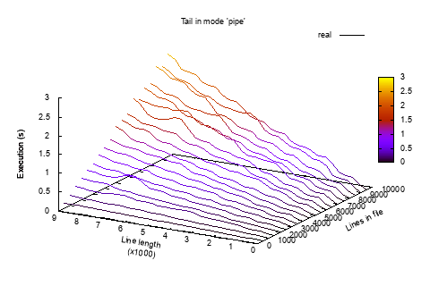

 Travis CI (Linux:gcc, Linux:clang, Mac OS X:clang)

# tail 

Interview Q&A task: write a command line program that outputs the 
last five lines of a file and provide the corresponding set of 
automated test cases. 

## Implementation

The two strategies were choosen:

1. For regular files the program search <n> new-lines backwards though 
the files, using the sliding window. Two distinct implementations for 
mapping file into window in the memory: with mmap regions and with
malloc+read_seek. It is expected that mmap implementation will be little 
faster (NB: which is not happen however).

2. For secial files, sockets, fifos, pipes the program reads the whole
file and stores the 5 last new-lines position into the ring buffer. The 
file context is also stored in ring buffer, that is freed dynamicaly.

So the program can operate in three modes: **mmap**, **read** and
**pipe**.

## How to build and build system

*CMake* was choosen as the primary build system. 
 
Also the *autoconf* solution (configure+Makefile) exists as the 
poorman fallback. The tests automation however is implemented only for
CMake. Autoconf only build the program.

So the way to compile everything is:
> mkdir build; cd build; cmake ..; cmake --build .
 
To run tests use:
> ctest
 
To run benchmarks:
> cd tests; ./bench.sh

## Testing

The helper in *c lanuage* **gen_text** was developed that can 
generate files with fixed and/or random content with given number of 
lines with a given length.
 
*CTest* checks that program can be started at all and then starts 
*Python*/**Behave** tests. *Behave* tests generates lot of test files with 
random content and compares the output of out "Tail" program with 
the output of POSIX *tail* utility. We are considering that tests pass it
the output is the same.

### Coverage

I'm testing the cases for 1-7 lines in a file. Also I'm specifically
testing for the cases when input file does not ends with newline. I'm
also test files with line length for 0 to 10000 chars.

### Benchmarking

Each working mode is benchmarking on the files from 1 to 10000 lines
with line length in range [1:10000]. Each benchmark runs several times
(currently 3). I choose not start benchmarks in parallel to simplify
integration with Travis and to get more steady results.
 
#### Tail in 'pipe' mode

#### Tail in 'mmap' mode

#### Tail in 'read' mode

## Integration

The project is hosted in GitHub, I set up the continious integration 
with the open service Travis CI. On every git commit it builds the
program and run the tests on Linux (gcc and clang) and MacOS (clang) 
environment. I also integrate the project with cloud code analitic 
service "coverity scan".
